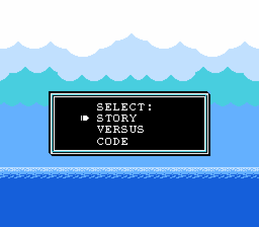
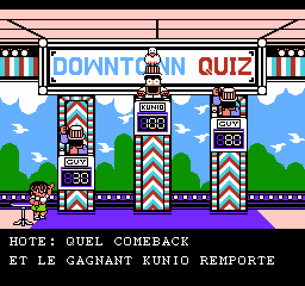
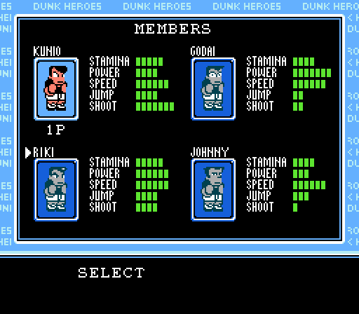

# Nekketsu Street Basket — Reverse-Engineering & FR Translation

[](https://github.com/Endymi0n74/nekketsu-street-basket-fr/actions/workflows/ci.yml) · [Wiki](https://github.com/Endymi0n74/nekketsu-street-basket-fr/wiki)

Documentation and tooling for the **French translation** of
*Nekketsu! Street Basket — Ganbare Dunk Heroes* (Famicom, 1993, Technos Japan),
plus the **disassembly** work that made it possible.

The published patch (`patch/`) turns the original Japanese ROM into a fully
French version, using Farid's English translation (v1.2 Final, October 2010)
as a working base, then replacing all text with French.

> ⚠️ **No ROM is included in this repository** (copyright).
> Base-ROM CRC32s and the IPS files are provided; apply the patch to your own
> dump.

---

## Status

| Step | Status |
|---|---|
| Complete FR translation (patch v1.2 Final) | ✅ Published (16/08/2026) |
| IPS patches JPN→FR and EN→FR | ✅ `patch/` |
| Banks 3 & 7 disassembly | ✅ `analysis/` |
| State machine (dispatcher, states/substates) | ✅ Mapped |
| Input routines + keyboard injection | ✅ Solved (PowerShell driver) |
| Verify the TACTICS screen in-match | 🔄 In progress |
| Full font reverse-engineering | 🔄 To deepen |

Current goal: navigate story mode → quiz → team → match, open the
**TACTICS** menu in-match and verify the 5 tactics
« **offensif marque frimeur automatic defensif** » (5 cells × 9 chars).

---

## Screenshots

The story → team → match flow, on the applied FR patch:

| Quiz (dialogue) | Team (SORT) | Match (VS) |
|---|---|---|
|  |  |  |

> The in-match **TACTICS** screen (5 cells: « offensif marque frimeur
> automatic defensif ») will be added here once the navigation is finished.

---

## Repository layout

```
├── README.md                     ← French overview
├── README.en.md                  ← English overview (this file)
├── CONTRIBUTING.md               ← contribution guide (issues/PR)
├── LICENSE                       ← MIT
├── wiki/                         ← reverse-engineering notes (FR, wiki mirror)
├── docs/
│   ├── 01-disassembly.md         ← ROM structure, banks, disassembly
│   ├── 02-state-machine.md       ← state machine ($0588/$0589, dispatcher)
│   ├── 03-input.md               ← input routines, keyboard injection
│   ├── 04-text-pipeline.md       ← font, text extraction, patching
│   ├── 05-emulator-notes.md      ← Mesen 2.1.1 / BizHawk pitfalls (broken APIs)
│   ├── 06-porting-guide.md       ← how to translate another NES game
│   ├── session-memory.md         ← working session log (French)
│   └── en/                       ← English versions of the docs above
├── tools/                        ← reusable scripts (Lua/PowerShell/Python)
│   ├── dis6502.py                ← minimal 6502 disassembler
│   ├── make_ips.py               ← IPS patch generation
│   ├── patch_rom.py              ← applies translations to the ROM
│   ├── translations.py           ← French translation table (source of truth)
│   ├── _mesen_dump.lua           ← Mesen capture harness (navigation + shots)
│   ├── _mt_hook.lua              ← state-machine tracer (WRAM hooks)
│   ├── _tact.lua                 ← state/substate hooks + screenshots
│   ├── _drive2.ps1               ← adaptive keyboard driver (focus + SendKeys)
│   ├── _focus.ps1                ← Mesen window focus (AttachThreadInput)
│   └── ...                       ← see docs/05-emulator-notes.md for the list
├── analysis/
│   ├── bank3_dis.txt             ← bank 3 disassembly (16,384 lines)
│   └── bank7_dis.txt             ← bank 7 disassembly (fixed, 16,384 lines)
├── screenshots/                  ← FR captures (title, quiz, SORT, match)
└── patch/
    ├── Nekketsu Street Basket (JPN) FR.ips         (19 KB — for the JAP ROM)
    └── Nekketsu Street Basket (v1.2 Final) FR.ips  (4 KB — for Farid's EN ROM)
```

---

## Required base ROMs

| Role | File | CRC32 (whole file, header included) |
|---|---|---|
| JAP base | `Nekketsu! Street Basket - Ganbare Dunk Heroes (Japan).nes` | `A2952508` |
| EN base | `... (v1.2 Final).nes` (Farid) | `A4680CA5` (SHA-1 `61c2ce554334266f675e878624a5bbc2e6fbfc73`) |
| FR result | patched ROM | `83B935AD` |

Size: 262,160 bytes (256 KB, 16-byte iNES header).

---

## What the work produced (summary)

1. **Disassembly**: `dis6502.py` (minimal 6502 disassembler) applied to the
   PRG banks, with full outputs for banks 3 (screen handlers) and
   7 (fixed: input routine, state dispatcher, bank-switch trampolines).
2. **State machine**: `$0588` = main state, `$0589` = substate.
   Dispatcher at `$CA79` (bank 7), handler table at `$CA8B`. Observed flow:
   boot → quiz (state 04) → title (state 03, attract) → SORT menu (state 02).
3. **Input**: poll routine at `$F973`/`$FF80` (bank 7), bits 7=A 6=B
   5=Sel 4=Start 3=Up 2=Down 1=Left 0=Right. Mesen 2.1.1's Lua `setInput` is
   **broken** (no-op), so input is injected through the **real keyboard** via a
   PowerShell driver (window focus + `SendKeys`).
4. **Text**: outline font (16 px), limited charset (a-z/0-9/space/!?.'), the
   translation table lives in `translations.py`, applied by
   `patch_rom.py` (preserves control bytes and name tokens), IPS generated by
   `make_ips.py`.

See `docs/` (or `docs/en/`) for details.

---

## License & credits

- Code, tools and documentation: [MIT](LICENSE). **No ROM is included** —
  apply the patch to your own dump of the original game (CRC32s in the
  Required base ROMs section).
- **French translation**: free to use and redistribute with credit to the
  translators. It builds on Farid's English translation (v1.2 Final,
  October 2010) as a base.
- Original game: *Nekketsu! Street Basket — Ganbare Dunk Heroes* © 1993
  Technos Japan.
- Contributions welcome — see [CONTRIBUTING](CONTRIBUTING.md).
